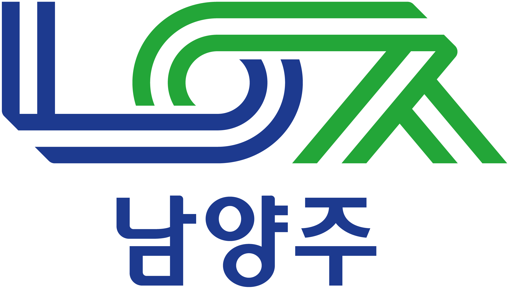
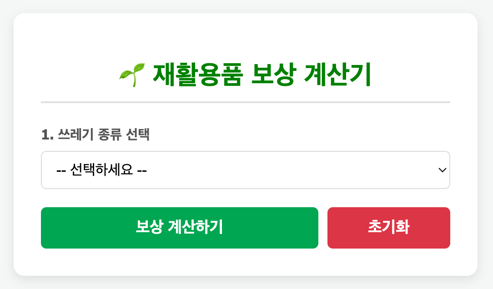
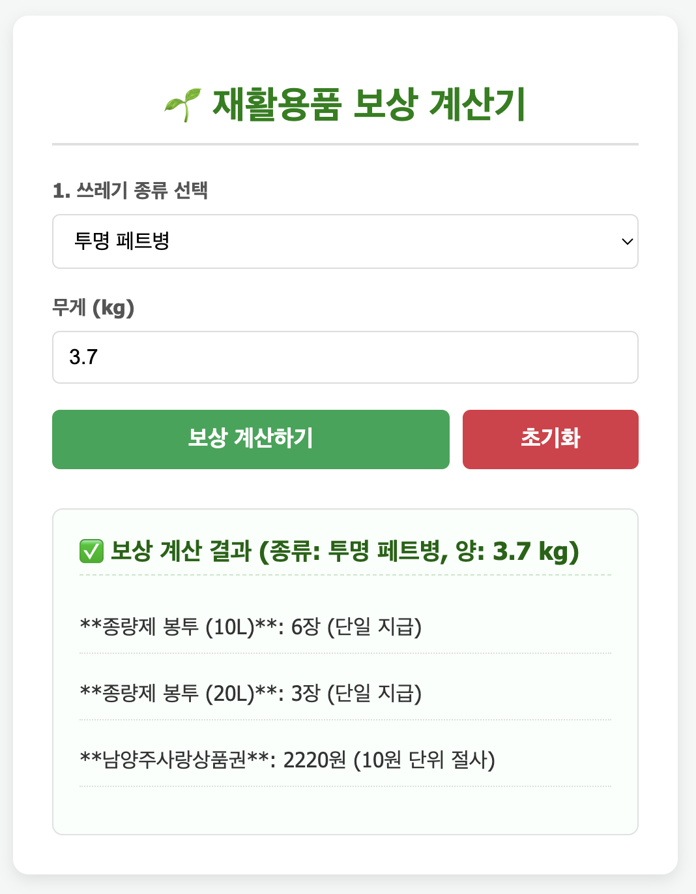

<!-- PROJECT LOGO -->

    
    <h3 align="center">재활용쓰레기 인센티브 지급 계산기</h3>
    
남양주시 자원재활용 활성화 사업 관련 인센티브 계산기!

<!-- ABOUT THE PROJECT -->
## 🌱 About The Project

남양주시는 [자원재활용 활성화 사업](https://www.nyj.go.kr/www/contents.do?key=3010)의 일환으로 2025년 1월부터 올바른 분리배출 활성화를 위해 재활용품 중 특정 5개 품목(투명페트병, 재사용의류, 종이팩, 폐전지, 폐형광등)을 대상으로 인센티브를 제공하고 있습니다.  
본 웹 서비스(이하 인센티브 계산기)는 대상 품목을 가져오는 시민이 재활용 쓰레기 품목을 가져왔을 때 지급 받는 인센티브가 얼마인지 확인할 수 있습니다.
  
남양주시에는 대부분 품목의 무게(혹은 개수)에 대해서 종량제 봉투를 **올림 처리**하여 지급하고 있습니다.  
하지만 별내동 행정복지센터에서는 행정 상의 이유로 **반올림 처리**를 사용하고 있습니다.  
인센티브 계산기는 이러한 상황을 고려하여 인센티브를 어떻게 지급하는 지를 계산합니다.

공공 목적으로 제작되었으며 자유롭게 이용하실 수 있습니다.

<!-- BUILT WITH -->
### Built With

* ![HTML][HTML-logo]
* ![JavaScript][JavaScript-logo]
* ![CSS][CSS-logo]

<!-- URL -->
### URL

다음 URL을 통하여 사용하실 수 있습니다:
**https://rondaron.github.io/byeollae-trash**

<!-- SCREENSHOT -->
### Screenshot

<!-- MARKDOWN LINKS & IMAGES -->
[CSS-logo]: https://img.shields.io/badge/CSS3-1572B6?style=for-the-badge&logo=css3&logoColor=white
[HTML-logo]: https://img.shields.io/badge/HTML5-E34F26?style=for-the-badge&logo=html5&logoColor=white
[JavaScript-logo]: https://img.shields.io/badge/JavaScript-F7DF1E?style=for-the-badge&logo=javascript&logoColor=black
[namyangjusi-logo]: images/NamyangjusiLogo.png
[web-screenshot]: images/screenshot.png